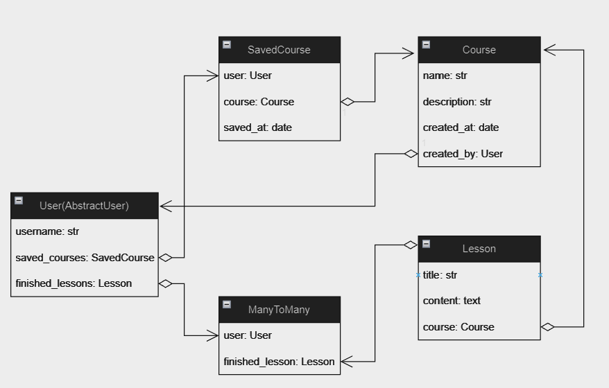

# Online Course Platform
## Project Description
Online Course Platform is a web-based platform built using Django. 
It allows users to create, view, and manage online courses. 
The platform also lets users save their preferred courses 
to a "Saved Courses" list and mark lessons as completed. 
(This is my first pet project, aimed at honing my skills in Django and web development.)

## Features
- **Course List:** View all available courses on the platform.
- **Course Details:** Access information about course, including the lessons it contains
- **Save Courses:** Save courses to your "Saved Courses" list for easy access later.
- **Complete Lessons:** Mark lessons as completed to track your progress of course.
- **Create/Update/Delete Courses:** Authorized users can manage courses by creating, updating, or deleting them.
- **Create/Update/Delete Lessons:** Authorized users can manage lessons by creating, updating, or deleting them.

## Model Diagram



## Setup

### Clone the Repository
Clone the repository to your local machine:
```bash
git clone https://github.com/your-repository.git
cd your-repository
```

### Virtual Environment

Create a virtual environment:
```bash
python -m venv env
```
Activate the virtual environment:
- On Windows:
```bash
.\env\Scripts\activate
```
- On macOS/Linux:
```bash
source env/bin/activate
```

### Install Requirements

Install the required packages:
```bash
pip install -r requirements.txt
```

### Database Setup

Apply migrations to create the necessary database tables:
```bash
python manage.py migrate
```
Create a superuser for Django admin access:
```bash
python manage.py createsuperuser
```

### Run the Server

Start the Django server:
```bash
python manage.py runserver
```
Open your web browser and navigate 
to http://127.0.0.1:8000/ to view the project.

If you want to load pre-populated data into 
the database, use the following command:

```bash
python manage.py loaddata data.json
```
